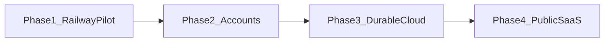

# Roadmap: Railway pilot → worldwide SaaS

This document is the forward plan after Phase 1 (Railway + volume + Basic Auth).  
**Current launch strategy:** finish build-out (Stages 4–6) before director access — see [`docs/launchnotes.md`](launchnotes.md).

Do **not** skip ahead: auth without ownership checks, or public signup on a shared SQLite volume, creates painful migrations.

| When | Phase |
|------|--------|
| Done | **Phase 1** — Railway + volume + Basic Auth |
| Done | **Phase 2** — per-director accounts |
| **Now** | **Phase 3** — Turso wired (5a); R2 + drop volume still open (5b) |
| After build-out + director feedback | **Phase 4** — public signup, Stripe live, in-app feedback, quotas |

---

## Phase 1 — Railway pilot (done in repo)

- [`src/proxy.ts`](../src/proxy.ts) — HTTP Basic Auth when `BASIC_AUTH_PASSWORD` is set
- [`src/app/api/health/route.ts`](../src/app/api/health/route.ts) — unauthenticated health check
- [`railway.toml`](../railway.toml) + [`nixpacks.toml`](../nixpacks.toml) — start command, native build deps
- README deploy section — volume at `/app/data`, env vars, how to share the link

**Exit criteria:** directors use the HTTPS URL with a shared password; data survives redeploy.

---

## Phase 2 — Per-director accounts (implemented)

**Status:** Auth.js credentials + ownership checks are in the repo.

- [`src/auth.ts`](../src/auth.ts) — Auth.js credentials provider
- [`src/lib/auth-guard.ts`](../src/lib/auth-guard.ts) — `requireUser` / `requireProjectAccess`
- [`users`](../src/db/schema.ts) table + `projects.userId`
- `/login`, `/signup`, `POST /api/auth/signup`
- Project-scoped APIs return 401/404 when not owned
- Enable with `AUTH_SECRET` (+ `AUTH_URL` in production). Optional `ALLOW_SIGNUP=false`.

**Exit criteria:** two directors on the same URL cannot see each other’s projects.

### Remaining checklist
- [x] `users` + `projects.userId` schema + migrate
- [x] Auth.js credentials sign-in / sign-up UI
- [x] Ownership checks on project-scoped `/api/*` handlers
- [x] Optional Basic Auth still available as outer gate
- [x] `ALLOW_SIGNUP` flag for invite-only mode
- [ ] OAuth providers (Google, etc.) if directors prefer
- [ ] Assign legacy orphan projects (`user_id` null) to an admin

---

## Phase 3 — Durable cloud backend

**Status:** Storage abstraction stubbed ([`src/lib/storage.ts`](../src/lib/storage.ts)); local volume remains default. **Blocker before director access.**

### Checklist
- [x] **PDF export polish** — blank pages, layout, preview UX (`src/app/api/export/route.tsx`) — see launchnotes Stage 3b
- [x] Choose Turso; wire Drizzle via `@libsql/client` (local `file:` or `TURSO_DATABASE_URL`)
- [x] Schema bootstrap + legacy column migrations on `ensureDb()`
- [x] Storage helper with local default (`putUploadObject` / `getUploadObject`)
- [ ] Implement S3/R2 backend behind `S3_BUCKET`
- [ ] Drop Railway volume dependency
- [x] **Host decision:** stick with **Railway** for the Next.js app through public launch (see launchnotes Infrastructure)

### Scale note

Railway + Turso/Neon + R2 is sufficient for hundreds to low thousands of registered users. Single-region latency is acceptable for a prep tool; R2 serves media globally.

---

## Phase 4 — Public worldwide SaaS

**Status:** Quota counters + plan fields on `users`; Stripe checkout/webhook scaffolded. Billing flag off until monetization gate.

### Checklist
- [x] Per-user monthly Claude quota (`checkAndIncrementChatQuota`)
- [x] Plan fields (`free` / `solo` / `pro` / `dramaturg`) + Stripe customer id column
- [x] Install `stripe` and verify webhook signatures
- [ ] Checkout + Customer Portal UI (Solo checkout in scene panel still pending)
- [ ] Stripe test-mode E2E (build-out); live checkout at monetization gate
- [ ] Email verification + abuse rate limits
- [ ] Staging environment smoke test
- [ ] In-app feedback form (`/feedback`) before wider Free signup — see launchnotes Feedback section
- [ ] Full legal pages before wide public launch
