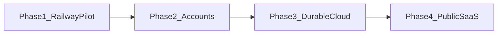

# Roadmap: Railway pilot → worldwide SaaS

This document is the forward plan after Phase 1 (Railway + volume + Basic Auth).  
Do **not** skip ahead: auth without ownership checks, or public signup on a shared SQLite volume, creates painful migrations.

| When | Phase |
|------|--------|
| Now | **Phase 1** — Railway + volume + Basic Auth (implemented) |
| After first director feedback | **Phase 2** — per-director accounts |
| Concurrent users / no single-volume limit | **Phase 3** — hosted DB + blob storage |
| Public launch / charging | **Phase 4** — signup, Stripe, quotas |

---

## Phase 1 — Railway pilot (done in repo)

- [`src/proxy.ts`](../src/proxy.ts) — HTTP Basic Auth when `BASIC_AUTH_PASSWORD` is set
- [`src/app/api/health/route.ts`](../src/app/api/health/route.ts) — unauthenticated health check
- [`railway.toml`](../railway.toml) + [`nixpacks.toml`](../nixpacks.toml) — start command, native build deps
- README deploy section — volume at `/app/data`, env vars, how to share the link

**Exit criteria:** directors use the HTTPS URL with a shared password; data survives redeploy.

---

## Phase 2 — Per-director accounts (implemented)

**Status:** Auth.js credentials + ownership checks are in the repo.

- [`src/auth.ts`](../src/auth.ts) — Auth.js credentials provider
- [`src/lib/auth-guard.ts`](../src/lib/auth-guard.ts) — `requireUser` / `requireProjectAccess`
- [`users`](../src/db/schema.ts) table + `projects.userId`
- `/login`, `/signup`, `POST /api/auth/signup`
- Project-scoped APIs return 401/404 when not owned
- Enable with `AUTH_SECRET` (+ `AUTH_URL` in production). Optional `ALLOW_SIGNUP=false`.

**Exit criteria:** two directors on the same URL cannot see each other’s projects.

### Remaining checklist
- [x] `users` + `projects.userId` schema + migrate
- [x] Auth.js credentials sign-in / sign-up UI
- [x] Ownership checks on project-scoped `/api/*` handlers
- [x] Optional Basic Auth still available as outer gate
- [x] `ALLOW_SIGNUP` flag for invite-only mode
- [ ] OAuth providers (Google, etc.) if directors prefer
- [ ] Assign legacy orphan projects (`user_id` null) to an admin

---

## Phase 3 — Durable cloud backend

**Status:** Storage abstraction stubbed ([`src/lib/storage.ts`](../src/lib/storage.ts)); local volume remains default.

### Checklist
- [ ] Choose Turso vs Neon; wire Drizzle client (replace `better-sqlite3`)
- [ ] Migrate schema + data
- [x] Storage helper with local default (`putUploadObject` / `getUploadObject`)
- [ ] Implement S3/R2 backend behind `S3_BUCKET`
- [ ] Drop Railway volume dependency
- [ ] Decide Railway vs Vercel for the Next.js app

---

## Phase 4 — Public worldwide SaaS

**Status:** Quota counters + plan fields on `users`; Stripe webhook route scaffolded at `/api/billing/webhook`.

### Checklist
- [x] Per-user monthly Claude quota (`checkAndIncrementChatQuota`)
- [x] Plan fields (`prep` / `dramaturg`) + Stripe customer id column
- [ ] Install `stripe` and verify webhook signatures
- [ ] Checkout + Customer Portal UI
- [ ] Email verification + abuse rate limits
- [ ] Staging environment, monitoring, legal pages
