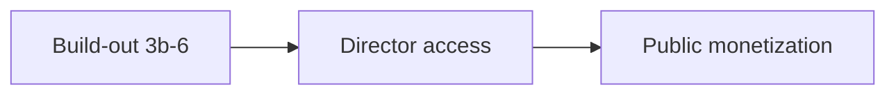

# Launch notes (locked direction)

**Initial public launch:** Free (short-film demo, 15-scene cap) + Solo (1 project, unlimited scenes) + Pro ($15/mo, unlimited projects). **Agent ($29/mo) is waitlist only** — ship after audience demand (Stage 7).

Positioning: short-film prep done really well. Features/series can still use it — we just don't market them first. No page-upload limit; the Free gate is a **scene count**, not pages (pages are trivially gameable once storage is headings-only, and scenes are the real unit of value — one canvas per scene).

**Privacy (launch):** All tiers store **scene slugs + scene numbers only** — not dialogue or action. Client-side PDF parse; server never persists script bodies. See Stage 1.

---

## Where we are (Aug 2026)

| Stage | Status | Notes |
|-------|--------|--------|
| 1 — Slug-only ingest | **Done** | |
| 2 — Free / Solo / Pro entitlements | **Done** | Scene cap, API guards, `entitlements.ts` |
| 3 — UX polish | **Done** | Prep pace footer, tech recce, scene panel |
| 3b — PDF export polish | **Done** | Chunked pages, empty gates, preview loading + in-dialog errors |
| 4 — Stripe (Solo + Pro) | **Code ~90%** | API + webhook done; **Solo checkout UI missing**; Stripe dashboard ops not live |
| 5 — Production DB + R2 | **5a–b done** | Turso + R2 code wired; **set R2 env on Railway**, then drop volume |
| 6 — Go-live | **~40%** | Landing + legal stubs; feedback portal + waitlist TBD |
| 7 — Agent tier | **Out of scope** | Waitlist only at launch |

**Current focus:** Finish Stages **4–6** (build-out) before sharing with real users. Single Railway service from `main` — no parallel beta/staging split.

**Priority within build-out:** Point Railway at R2 (`S3_*` env), smoke-test uploads across redeploy, then Stripe test-mode E2E + Stage 6 polish.

**Not sharing yet** until Turso + R2 env are live and core flow is smoke-tested on deploy.

**Deploy model:** Railway app server + hosted DB + R2 object storage. SQLite volume is interim for local dev only.

---

## Launch sequence

| Phase | When | Who | Billing |
|-------|------|-----|---------|
| **Build-out** | Now | You only (local + deploy smoke tests) | Off |
| **Director access** | After Stages 4–6 | Known directors; Free by default; comp Pro/Solo via `set-plan.mjs` | Off |
| **Public monetization** | When ready | Open signup; waitlist optional | Flip `NEXT_PUBLIC_ENABLE_BILLING_CHECKOUT` |

### Build-out exit criteria (Stages 3b–6)

- **PDF export** passes real-project QA — no blank pages; scene packs readable on set (Stage 3b)
- Stripe Checkout + Portal + webhook tested end-to-end in **test mode** (billing flag stays off)
- Turso or Neon wired; R2 for uploads; Railway volume no longer required
- Smoke test on deploy: signup → import → canvas → **export** → redeploy (data survives)
- Greyed Solo/Pro pricing visible; "launching soon" at limit points
- **In-app feedback** link live for signed-in users (Stage 6 — see Feedback below)
- Legal stubs adequate for director access; full legal before wide public launch

### Director access exit criteria

- Directors complete at least one real prep loop (short on Free, or feature on comp'd Pro)
- Bug fixes shipped; no blockers on core workflow
- Billing still off — no public checkout

### Monetization gate (flip billing)

Enable `NEXT_PUBLIC_ENABLE_BILLING_CHECKOUT=true` only when:

- [ ] Directors validated core prep loop on Free and/or comp'd Pro
- [ ] Stripe **live** checkout tested for Solo ($9) and Pro ($15)
- [ ] Legal pages adequate for paid subscriptions
- [ ] Optional: waitlist captured demand at limit points

---

## Infrastructure

Railway is the default production host through public launch and early growth (hundreds to low thousands of registered users), **after Stage 5**:

| Component | Build-out target |
|-----------|------------------|
| App server | Railway (single region; scale replicas if needed) |
| Database | Turso or Neon (not SQLite volume) |
| Uploads | Cloudflare R2 via `S3_*` env |

**Why this works:** client-side PDF parse, slug-only DB rows, bursty prep sessions, canvas media on R2 CDN, Agent off at launch.

**Scale expectations:**

| Registered users | Verdict |
|------------------|---------|
| 10–100 | Comfortable — one replica |
| 100–1,000 | Fine — monitor DB connections |
| 1,000–5,000 | Fine with tuning — watch export CPU |
| 10,000+ active / Agent on | Revisit architecture |

**Cost ballpark (excluding Agent):** infra ~$50–125/mo at 500–1,000 registered; break-even at ~5–8 paid subs. Solo $9 + Pro $15; at 10% paid conversion on 1,000 registered ≈ $1,140 MRR gross.

---

## Tiers at initial launch (Gates 0–6)

| | **Free** | **Solo** | **Pro** | **Agent** (not sold yet) |
|---|----------|----------|---------------------------|--------------------------|
| Price | $0 | **$9/mo** | **$15/mo** | **$29/mo** (waitlist) |
| Projects | 1 | 1 | Unlimited | Unlimited (reserved) |
| Scripts / project | 1 | 1 | Unlimited | Unlimited (reserved) |
| Scenes / project | **First 15 unlocked** | Unlimited | Unlimited | Unlimited (reserved) |
| Org (canvas, schedule, export, remap) | Full (unlocked scenes) | Full | Full | Full (reserved) |
| Script storage | Slugs only | Slugs only | Slugs only | Slugs only (reserved) |
| Agent / dramaturg | **Off** | **Off** | **Off** | On after Stage 7 |
| Agent calls / mo | 0 | 0 | 0 | ~180 (reserved) |

### Scene cap mechanics (Free)

- Bulk script import creates **all** scenes (headings aren't sensitive); scenes past #15 (project-wide order) are **visible but locked** in the scene list — greyed, lock icon, upgrade toast on click. Upgrading unlocks instantly, no re-upload.
- Manual "+ Add scene" / "Insert scene below" is **rejected at the API** (`checkSceneCreateAllowed`, 403 `plan_limit`) once the project has 15 scenes — closes the add-one-at-a-time workaround.
- Cap lives in `FREE_SCENE_CAP` (`src/lib/entitlements.ts`) — tune after watching real signups hit it.
- Implementation: `src/components/scene/scene-panel.tsx` (locked rows), `src/lib/entitlement-guard.ts` (manual add guard).

### Upgrade story

> Free to prep a short (first 15 scenes). Solo when your film is bigger than that. Pro when you need more projects or episodes. Agent when canvas riff + performance-notes Generate ships — join the waitlist until then.

### Agent waitlist (launch)

- No Stripe Checkout for Agent at go-live.
- Optional **coming soon / waitlist** CTA (email capture only) — **not built yet**.
- Agent tier unlocks: canvas riff, performance-notes Generate, monthly action quota — **never full uploaded script bodies in AI prompts**.

### Feedback vs waitlist

These serve different jobs — do not conflate them:

| | **Feedback** | **Waitlist** |
|---|----------------|--------------|
| Purpose | Product thoughts, bugs, UX pain | Purchase intent for Solo/Pro/Agent |
| Who | Active Free (and comp'd) users | Users at tier limits or pricing page |
| When | Director access onward | Before / at public monetization |

**Best practice (early SaaS):** feedback belongs **in-app**, not only on the landing page. Signed-out visitors on the landing page have not used the product yet — a landing footer link is fine for general interest, but the high-signal feedback comes from people mid-prep.

**Recommended placement:**

1. **Primary — in-app (signed-in):** "Feedback" link in the home dashboard header/footer and/or project workspace menu → `/feedback` form. Prefill email + plan from session; optional category (bug / export / idea / other) + free text.
2. **Secondary — landing footer:** small "Feedback" link for pre-signup questions (same form, email required).
3. **Optional later — contextual prompt:** after a successful PDF export download ("How was this pack?") — high signal for export work; defer until Stage 3b is stable.

**Implementation (lightweight, solo-founder friendly):**

- **Build-out minimum:** `POST /api/feedback` → store in DB (`feedback_submissions`: user id, email, plan, category, message, created_at) + optional email notify via Resend to founder inbox.
- **Faster skip-DB option:** embed Tally or Google Form at `/feedback` — less context (no auto plan), fine for director access only.
- **Overkill for now:** Canny, Intercom, Featurebase — revisit if volume grows.

**Launch timing:**

- **Director access (closed circle):** email/DM is enough; in-app form nice-to-have.
- **Before wider Free signup:** ship in-app `/feedback` — required in build-out exit criteria if opening beyond hand-picked directors.

---

## Pre-launch product work

### Shipped

- [x] Org-first canvas: shot list, image grid, layout templates, export appendix controls
- [x] Script revision review modal (slug-level diff rework in Stage 1E)
- [x] Performance notes + scene synopsis canvas nodes
- [x] Prep pace tracker + footer status bar (progress %, prep / tech recce / shoot dates)
- [x] Free / Solo / Pro tier matrix + 15-scene cap (visible-but-locked beyond cap)
- [x] Landing page (`src/components/marketing/landing-page.tsx`) — signed-out `/`, Start free → `/signup`
- [x] Privacy + Terms stubs (`/privacy`, `/terms`) — early-access copy
- [x] Beta plan grants: `scripts/set-plan.mjs` (`free` | `solo` | `pro` | `dramaturg`)

### Remaining before go-live (by stage)

- [x] **Stage 1:** Slug-only ingest, client parse, empty `rawText` on server
  - Legacy full-text paths closed: `POST /api/projects` rejects `rawText`; `/api/projects/with-scripts` (server-side PDF parse) deleted; scenes `PATCH` rejects body text.
  - Dev DB audited + scrubbed (legacy scene bodies and `parsed_meta` blanked). **Production deploys with pre-Stage-1 data need the same one-off scrub** (`UPDATE scenes SET raw_text = '', parsed_meta = NULL`).
- [x] **Stage 2:** Enforce Free / Solo / Pro entitlements
  - `src/lib/entitlements.ts` — matrix: Free (1 project, 1 script, 15 scenes), Solo (1/1/unlimited scenes), Pro (unlimited).
  - `src/lib/entitlement-guard.ts` — 403 `plan_limit` on project create, script create, and **manual scene create** past limits. Skipped when auth is off (local dev).
  - `/api/me` exposes `maxScenesPerProject` for client gating.
  - Agent stays off via `NEXT_PUBLIC_ENABLE_AGENT` + zero chat quota for Free/Solo/Pro.
  - Signup defaults to Free (`plan` null) — no demo project seeded (would consume the 1-project quota).
  - Legacy `plan = 'prep'` / `'organize'` rows migrate to `'pro'` on DB open.
- [x] **Stage 3:** Upload copy, scene panel (no server screenplay reader), replace-script UX polish
  - Slug-only privacy note on every upload surface (scene panel footer, new-project page, add-episode dialog): "We parse/store scene headings only…".
  - Dead `ScreenplayView` component (pre-slug-only server reader) deleted; no `rawText` rendered anywhere in the UI.
  - Slug-only guards live-verified: `PATCH /api/scenes` rejects body text (400), `POST /api/scenes` rejects multipart uploads (400), `POST /api/projects`/`/api/scripts` reject `rawText`. Server scene writes always persist `SLUG_ONLY_RAW_TEXT` (`""`).
  - Scene panel: manual add/insert/edit/delete, pinned Add-scene form (save/cancel visible without scrolling), prep checkboxes with optimistic PATCH.
  - Prep pace tracker: project-wide (all episodes) prepped counts, footer status bar, optional finish-by-tech-recce deadline. Verified in browser incl. scenes/day math.
- [x] **Stage 3b:** PDF export polish
  - [x] Skip blank/stub pages: no cheat-sheet page when sheet empty (pack mode goes straight to canvas appendix).
  - [x] Skip empty canvas appendix pages (empty shot lists, performance notes, image grids; chunk helpers no longer emit `[[]]` pages).
  - [x] Filter scenes with nothing exportable before rendering combined PDF / zip (single-scene pack uses the same `sectionHasExportContent` gate).
  - [x] Fix remaining blank pages from layout overflow: chunk cheat-sheet / ref-table / mood / image appendix pages; text notes wrap like synopsis; performance notes pack by estimated height and split fat beats.
  - [x] Export dialog + preview UX: preview opens immediately with loading panel; in-dialog empty-state banner; spinners on Preview/Download; typed client errors.
  - **Exit criteria:** export a real project (10+ scenes, images, shot list) → open PDF on phone/laptop → no blank pages; slug + shoot-day order correct; readable on set.
- [ ] **Stage 4:** Stripe Checkout + Portal for Solo + Pro
  - **Done in code:**
    - `POST /api/billing/checkout` — body `{ plan: "solo" | "pro" }` (default Pro) → `STRIPE_PRICE_SOLO` / `STRIPE_PRICE_PRO`.
    - `POST /api/billing/portal` — Customer Portal (manage / cancel).
    - `POST /api/billing/webhook` — signature-verified; checkout + subscription events sync `users.plan` (`solo` | `pro` ↔ `free`). Agent tier never granted here.
    - Pro UI behind `NEXT_PUBLIC_ENABLE_BILLING_CHECKOUT`: home Upgrade to Pro ($15/mo), Manage billing, at-limit new-project CTA, `?billing=` toasts.
    - All routes return 503 when `STRIPE_*` env is unset.
  - **Still to do (product):**
    - [ ] **Solo checkout in UI** — wire `startCheckout("solo")` from scene panel (enabled when billing flag on).
    - [x] Set Solo price target: **$9/mo** (`STRIPE_PRICE_SOLO`).
    - [x] Landing pricing section — greyed Free / Solo / Pro cards (`landing-page.tsx`).
  - **Still to do (ops — build-out, test mode):**
    - [ ] Create Solo ($9) + Pro ($15) prices in Stripe Dashboard.
    - [ ] Set `STRIPE_SECRET_KEY`, `STRIPE_PRICE_SOLO`, `STRIPE_PRICE_PRO`, `STRIPE_WEBHOOK_SECRET`, `APP_URL`.
    - [ ] Point webhook at `/api/billing/webhook` (checkout.session.completed, customer.subscription.updated/deleted).
    - [ ] Test-mode checkout + cancel end-to-end for **both** Solo and Pro.
  - **Public monetization gate (later — not build-out):**
    - [ ] Enable `NEXT_PUBLIC_ENABLE_BILLING_CHECKOUT=true` on production.
- [x] **Stage 5a:** Turso / libSQL client
  - Chose **Turso** (same SQLite schema; no Postgres rewrite).
  - `@libsql/client` + `drizzle-orm/libsql`; local default `file:./data/performancenotes.db`.
  - Env: `TURSO_DATABASE_URL` + `TURSO_AUTH_TOKEN` for hosted.
  - All DB access async; `ensureDb()` runs schema/migrations on cold start.
  - `scripts/set-plan.mjs` supports Turso env or local file.
- [x] **Stage 5b:** Cloudflare R2 via `@aws-sdk/client-s3`
  - `putUploadObject` / `getUploadObject` use R2 when `S3_BUCKET` is set; local `data/uploads` otherwise.
  - Env: `S3_BUCKET`, `S3_REGION=auto`, `S3_ACCESS_KEY_ID`, `S3_SECRET_ACCESS_KEY`, `S3_ENDPOINT`.
  - Export + agent vision load images through the same helper.
- [ ] **Stage 5c–d:** Drop Railway volume, backups, deploy smoke — **blocker before director access**
  - Set `S3_*` on Railway; then unmount `/app/data` (DB is Turso, uploads are R2).
  - Smoke: signup → import → canvas image → export → redeploy (rows + images survive).
- [ ] **Stage 6:** Legal, feedback, waitlist, go-live
  - [x] Landing page (signed-out `/` vs dashboard split on projects 401).
  - [x] `/privacy` + `/terms` stubs (replace with full legal before public launch).
  - [x] Manual plan grants: `node scripts/set-plan.mjs <email> solo|pro`.
  - [x] Greyed pricing + "launching soon" copy at limits when billing off.
  - [ ] **In-app feedback** — `/feedback` page + `POST /api/feedback` (or Tally embed); link from dashboard + project workspace; landing footer secondary.
  - [ ] Full Privacy Policy + Terms (lawyer-reviewed or equivalent); mention feedback storage in Privacy.
  - [ ] Optional tier **waitlist** (email + tier + trigger) — before wide public launch, not required for closed director circle.
  - [ ] Agent waitlist CTA (email capture only).
  - [ ] Custom domain + `AUTH_URL` / `APP_URL` on final URL (Stage 6 gate for wide public launch).
  - [ ] Demo video — explicitly deferred; not blocking director access.

---

## Director access playbook (after build-out)

1. Deploy single Railway service with Turso/Neon + R2 (not volume-dependent).
2. Set `AUTH_SECRET`, `AUTH_URL`; keep `NEXT_PUBLIC_ENABLE_BILLING_CHECKOUT` **unset/false**.
3. Optional: `ALLOW_SIGNUP=false` for invite-only; otherwise open Free signup.
4. Share URL with directors → `/signup`.
5. Grant plans manually after signup:
   - Short-film tester: stay on **Free** (15-scene cap).
   - Feature / series tester: `railway run node scripts/set-plan.mjs their@email.com pro`.
   - One film, >15 scenes: `solo` if not Pro.
6. Collect feedback via in-app `/feedback` (or direct email for the first few); fix on `main`; redeploy. Billing stays off.

### Suggested build-out order

1. ~~**Stage 3b** — PDF export polish~~ **Done**
2. ~~**Stage 5a** — Turso / libSQL~~ **Done**
3. ~~**Stage 5b** — R2 uploads~~ **Done** (set `S3_*` on Railway, then drop volume)
4. **Stage 4** — Stripe test-mode E2E ← **next after R2 env + smoke**
5. **Stage 6** — feedback form, legal polish, domain
6. **Director access**

---

## Out of scope for initial launch

- **Agent product sale** ($29 Checkout, dramaturg chat, Generate) — waitlist only
- Full-script body storage on any tier
- Full-script dramaturg distill from uploaded PDF text
- OAuth / SSO
- Heavy monitoring / observability stack
- Starter / legacy Prep ($19) or old Pro ($35) tiers
- Page-count upload caps

---

## Plan enum (locked)

Stored on `users.plan`:

| Value | Meaning |
|-------|---------|
| `null` or `"free"` | Free tier (15-scene cap) |
| `"solo"` | Solo — 1 project, unlimited scenes |
| `"pro"` | Pro $15/mo |
| `"dramaturg"` | Agent $29/mo — **reserved**, not granted at launch |

Legacy `"prep"` / `"organize"` in dev DBs migrate to `"pro"` on DB open.

Implementation: [`src/lib/entitlements.ts`](../src/lib/entitlements.ts)
